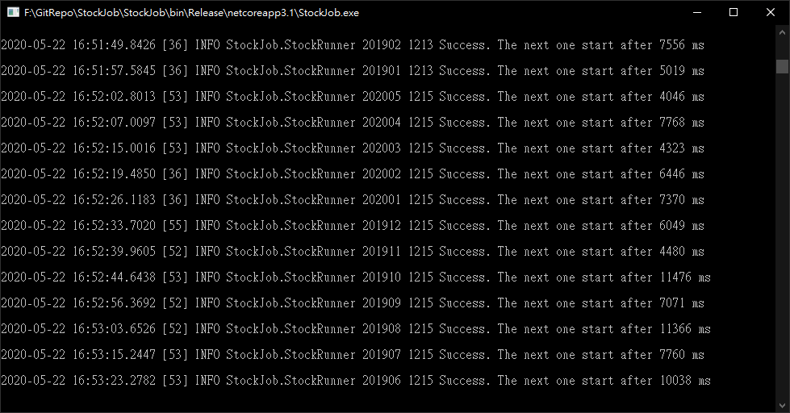
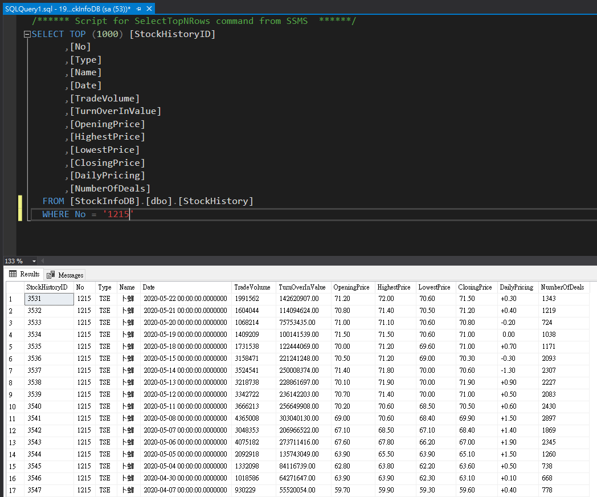

# StockJob
自製的歷史股價爬蟲

目前使用 .NET Core 3.1.19
請自行安裝SDK


## Getting Started
nlog.config記得填入你的Gmail並開啟第三方應用程式存取權(帳戶>安全性)，才能收到Error信件

填入您的DB ConnectionString (請勿在Production或公開環境使用這方式設定)
```C#
class StockDBContext : DbContext
{
    public DbSet<StockHistory> StockHistory { get; set; }
        protected override void OnConfiguring(DbContextOptionsBuilder options)
        => options.UseSqlServer(""); //←填入您的DB ConnectionString
}
```

在StockJob/StockJob.csproj那層的目錄下使用Powershell輸入以下更新資料庫
```
dotnet tool install --global dotnet-ef
dotnet ef database updat
```
用git sub module載入我的另一個Repository: [StockLib](https://github.com/TWKuanLun/StockLib)

---

#### StockJob/Program.cs

爬201701到現在這個月為止的所有股價資料到資料庫
```C#
await runner.OneTimeCrawler(new DateTime(2017, 1, 1));
```
爬201701到現在這個月為止的台泥(1101)股價資料到資料庫
```C#
await runner.OneTimeCrawler("1101", StockType.TSE, new DateTime(2017, 1, 1));
```
爬201701到201801為止的所有股價資料到資料庫
```C#
await runner.OneTimeCrawler(new DateTime(2017, 1, 1), new DateTime(2018, 1, 1));
```
爬20170101到201901為止的台泥(1101)股價資料到資料庫
```C#
await runner.OneTimeCrawler("1101", StockType.TSE, new DateTime(2017, 1, 1), new DateTime(2019, 1, 1));
```

所有DateTime都是以月為單位，不是以天為單位，new DateTime(2017, 5, 15)代表2017年5月(忽視15)。

skipByMonth參數用途：
如果您重複跑本程式，已爬過的股票月份會跳過。這對於沒辦法一次跑完的時候很有幫助，如果你是在平日跑的話，記得最後再爬一次全部股票從當月到當月。

目前跑一筆一個月的股價會Delay 4~12秒(隨機)，這是我找到不會被鎖IP的範圍，你可以找到更短的範圍當然更好，會越快跑完。

執行程式會有console給你看log，目前跑到哪裡


邊跑你可以邊看DB內抓到的資料

